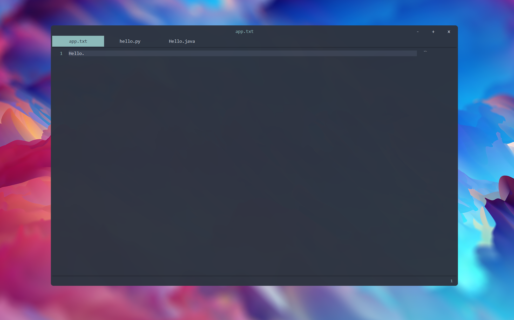

# NoteApp

### My attempt at a modern looking text editor. Created with PyQt5.

## Current Features List:
* New tab (ctrl + t)
* Close Tab (ctrl + w)
* Next Tab (ctrl + pgdn)
* Prev Tab (ctrl + pgup)
* move to tab 1 - 10 (ctrl + number)
* Open Files (ctrl + o)
* Save Files (ctrl + s)
* Save As (ctrl + shift + s)
* Reopen Closed Tabs (Ctrl + r)
* Right click tab to close
* Word count on bottom right
* Preview Pane on the right side of the screen that doubles as scroll bar
* Resize Window
* Slight Transparency effect
* Dynamic Line Numbering
* Window Snapping to the left, right, middle, top, bottom, and all 4 corners
* Right click while dragging window to snap window left or right
* Multiple monitor support
* Syntax Highlighting for multiple languages
* Find and replace functionality (ctrl + f)

## Future Features List:
* Settings Tab to be able to edit all of the typical text edit features
* Save indicator to show if a tab is currently saved or not
